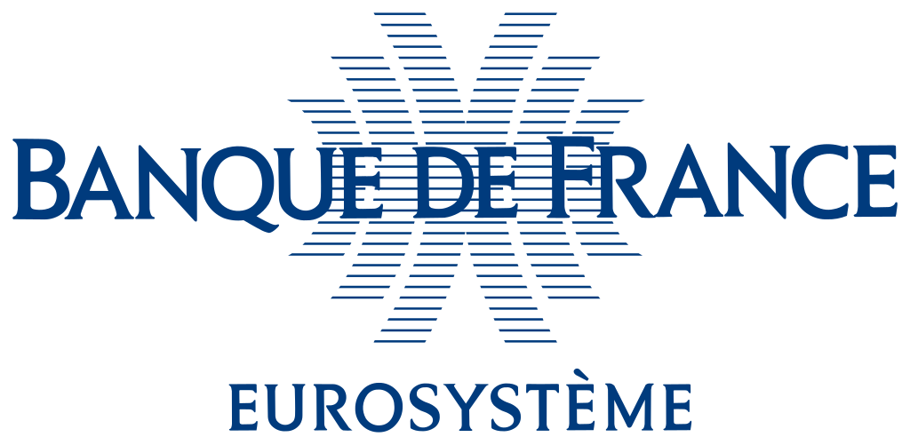

```{r, include = FALSE}
knitr::opts_chunk$set(
  collapse = TRUE,
	echo = FALSE,
	fig.align="left",
  comment = "#>"
)
```

```{r, out.width="20%"}
knitr::include_graphics(path = "../man/figures/logo_apidoc_center.png")
```

Le *package* `apidoc` documente l'accès aux API de certains producteurs de données.

{width="20%"}
{width="21%"}

{width="25%"}
{width="20%"}

{width="20%"}
{width="20%"}

```{r, out.width="20%", eval = FALSE}
knitr::include_graphics(path = "../man/figures/logo_imf.png")
```

Voir les infos dans les vignettes ou la rubrique `Articles`
